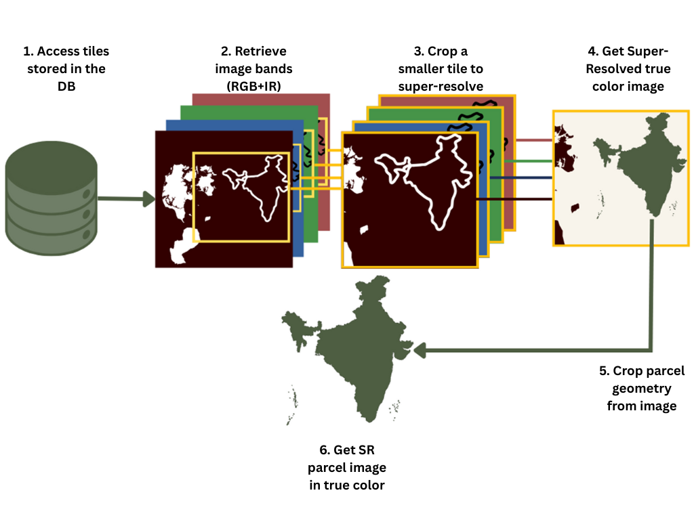

# AgrIA_server

This is the server side of the Agricultural Imaging Assistant (AgrIA). It includes information on how to setup and run the server side of AgrIA.

## Requirements:
- Python 3.10+
- `conda`, for simplified virtual environment package managing.
- Access to KHAOS' [`sigpac-tools`](https://github.com/KhaosResearch/sigpac-tools.git@07145bcaebcdf37bc5b24191950a3f0a666841b4) repository.
    - **To access the repository, contact [KHAOS Research](https://khaos.uma.es/?page_id=101) group.**

## Installation & Setup

### Python enviroment creation and activation:
Run the following commnands to create and activate the `agria_server_env` environment.
```bash
conda env create -f environment.yml
conda activate agria_server_env
```

You will also need to install `mamba` locally like this:
```
pip install mamba --no-build-isolation
```
>NOTE: this package requires NVIDIA CUDA Toolkit: `sudo apt install nvidia-cuda-toolkit`
After that, manually install `sen2sr` if needed:
```
pip install sen2sr mlstac git+https://github.com/ESDS-Leipzig/cubo.git -q
```
### System environment setup:
You will need to rename the `.env_example` file to `.env` and complete it with your own data.

**Content of your `.env` file:**
```bash
# Replace variables with your data and rename file to ".env"
GEMINI_API_KEY=YOUR_API_KEY
UI_URL=YOUR_FRONTEND_URL
API_PORT=XXXX
API_URL=http://yourApiDomain.com

# Contact authors to gain access to these database credentials and files
MINIO_ENDPOINT=255.000.000.000:0000
MINIO_ACCESS_KEY=minio-access-key
MINIO_SECRET_KEY="minio-secret-key"
bucket_name="bucket-name"

GEOMETRY_FILE = geometry-file.kml
```
**To get credentials to access the MinIO image database, contact [KHAOS Research](https://khaos.uma.es/?page_id=101) group.**

### SR Module Dependencies
The current implementation of the SR module is derived from the [Superres4Sentinel](https://github.com/MiguelPadillaR/SuperRes4Sentinel.git) repository. Modifications have been made from its original source. For more documentation, please refer to it.

The SR module requires `torch`, `rasterio`, `Pillow`, `opencv-python<4.12` and `numpy<2`. These are included in the provided `environment.yml`. If you install manually, ensure these packages are present in the correct version.

>### NOTE:
> At the time of development, `torch` package would not work with `numpy`'s latest version. Downgrades had to be made to the `numpy` package and the `opencv-python` package as a consequence.

## Server initialization:
After activating and setting up all environment, run the server by simply using:

```bash
python run.py
```

### Running the Super-Resolution module
The SR module can be invoked during server execution (e.g., when handling parcel image requests). It can also be run independently for testing:
```bash
python -m server.sr.process_sr --input path/to/input_dir --output path/to/output_dir
```
This will:
- Read the required band files (`B02`, `B03`, `B04` and `B08`)
- Run the SR model
- Save both a multiband GeoTIFF and a stretched PNG for quick visualization

>### NOTE:
>Input must be a directory with all bands with all the images you want. For each image, all four bands must share the same filename and include the band name somewhere in it.

## SuperRes4Sentinel workflow diagram:
In order to work, the image super-resolution taken by Agria performs the following workflow:

1. **Access tiles stored in the DB:** Using MinIO's credentials, it access the database where Sentinel’s tile bands are stored.
2. **Retrieve image bands:** Get the RGB bands (B02, B03, B04) for the tiles that contain the parcel as well as the infrarred band (B08).
3. **Crop a smaller tile to super-resolve:** Since the tiles are too big, a smaller crop containing the parcel is cut from each band.
4. **Get Super-Resolved true color image:** Pass the band crops to the L1BSR model and obtain a super-resolved RGB image (.tif*).
5. **Crop parcel geometry from image:** From the super-resolved image, and using the parcel's geometry, the parcell is cut out and returned to the user.



>### NOTE:
>**In case no tiles are found in the database**, the bands can be directly taken from Sentinel using its API's Python package (`sentinelhub`) with the proper credentials. ***(IN PROGRESS)***
## Project structure:
By the end of the setup process, your directory structure should look like this:

```raw
Agria_server:.
|   .env
|   .gitignore
|   environment.yml
|   README.md
|   run.py
|   
+---assets
|   |       
|   \---geojson_assets
|   |       *.kml
|   |       
|   \---LLM_assets
|       +---context
|       |   |   context_document_links.json
|       |   |   
|       |   \---files
|       |           220930_nota_aclaratoria_aplicacion_eco_regimenes.pdf
|       |           230306_pmf4-ecorregimenes_v4.pdf
|       |           
|       \---prompts
|               LLM-full_desc_example.txt
|               LLM-full_desc_prompt.txt
|               LLM-role_prompt.txt
|               LLM-tldr_desc_example.txt
|               LLM-tldr_desc_prompt.txt
|               prompt_list.json
|               
+---server
|   |   __init__.py
|   |   
|   +---config
|   |       chat_config.py
|   |       config.py
|   |       constants.py
|   |       env_config.py
|   |       llm_client.py
|   |           
|   +---endpoints
|   |       chat.py
|   |       parcel_finder.py
|   |           
|   +---services
|   |       chat_service.py
|   |       llm_services.py
|   |           
|   +---sr
|   |       get_sr_image.py
|   |       L1BSR_wrapper.py
|   |       RCAN_wrapper.py
|   |       README.md
|   |       REC_Real_L1B.safetensors
|   |       
|   +---utils
|           chat_utils.py
|           config_utils.py
|           llm_utils.py
|           parcel_finder_utils.py
|           
\---test
        conftest.py
        test_hello.py
        test_image_upload.py
        test_user_input.py
```

### Directory overview:
This is a brief overview of each main directory in the project structure:
- `assets`: All resources the server uses are stored here.
  - `geojson_assets`: Ideally, where you'd put your `GEOMETRY_FILE`, but as long as you assign the variable the correct path to the `.kml` file, it doesn't matter.
  - `llm_assets`: Stores context files and prompts for LLM initialization and role assignment. JSON files contain file paths information and are accessed by the server to pass to AgrIA as system instructions.
- `server`: Contains all server's main logic components and directories:
  - `config`: Holds configuration-related files: from constants used all-over to initialization configuration.
  - `endpoints`: Keeps all endpoints access and methods to a single file for each UI component.
  - `services`: Stores files with all the methods that call external services outside of our project scope.
  - `sr`: Super-resolution (SR) module for satellite imagery.Handles upscaling Sentinel-like input images (B02, B03, B04, B08 bands) using a deep learning model.  
    - `get_sr_image`: Orchestrates SR processing for directories and handles saving results (GeoTIFF + PNG).
    - `L1BSR_wrapper.py`: Wrapper for the SR model L1BSR's implementation.
    - `RCAN_wrapper.py`: Wrapper for the RCAN model's architecture.
    - `REC_Real_L1B.safetensors`: Pre-trained L1BSR model. 
  - `utils`: An assortment of functions and methods that  help  all the data processing that mainly comes from endpoint input requests.
- `tests`: A batery of integration tests for the server **(TODO)**.